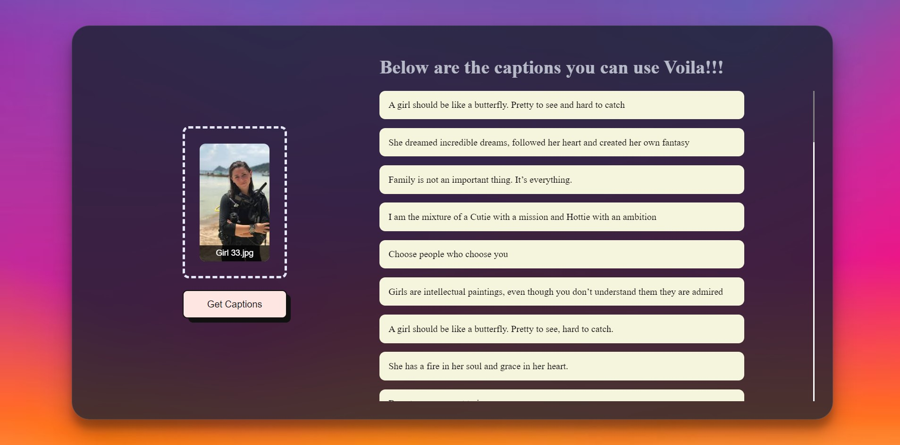

## InstaCapGenerator

The Instagram Caption Generator using VGG-16 is a web application that automatically generates creative and relevant captions for your Instagram photos. This intelligent tool utilizes the powerful VGG-16 deep learning model to analyze the content of your images and generate captions that best describe the visual elements.

  The process is seamless and user-friendly - simply upload your photo through the web interface, and within seconds, the application will provide you with a list of captivating captions to choose from. No more struggling to come up with the perfect caption; let our advanced AI-powered generator do the work for you!

### How it Works
1. Upload your photo through the web interface.
2. The VGG-16 deep learning model will analyze the image and extract key features.
3. Based on the extracted features, the system generates a selection of creative and relevant captions.
4. Choose your favorite caption or customize it to suit your style.
5. Copy the caption and paste it into your Instagram post.

### Features
<ul>
<li>VGG-16 Model: Powered by the state-of-the-art VGG-16 deep learning model for accurate image analysis.</li>
<li>Creative Captions: Get unique and creative captions that enhance the visual appeal of your photos.</li>
<li>Customization: Modify generated captions to match your personal style and preferences.</li>
<li>Fast and Efficient: Instantly receive captions without any long waits.</li>
<li>User-Friendly Interface: A simple and intuitive web interface for a seamless user experience.</li>
<li>Mobile-Friendly: Access the application from your desktop, laptop, or mobile devices.</li>

</ul>

### Technology Used
Backend: Python, Flask 
Frontend: HTML, CSS, JavaScript 
Deep Learning Model: VGG-16 
